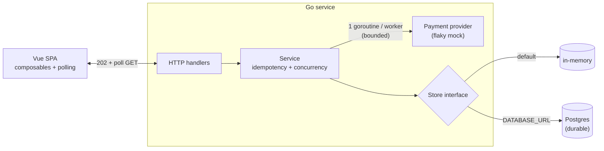

# Cadana · Disbursements

A small full-stack tool for payroll-ops: review pending payouts, kick off a disbursement
batch, and watch per-worker results stream in — even when the payment provider flakes.

[](https://github.com/zainishtiaqdev/cadana-disbursements/actions/workflows/ci.yml)

**Stack:** Go (backend) · Vue 3 + TypeScript (frontend) · optional Postgres/Supabase for durable state.

**Live demo:** https://cadana.zainishtiaq.com &nbsp;·&nbsp; **API:** https://api.cadana.zainishtiaq.com


---

## Run it

**Backend** — in-memory, zero setup:
```bash
cd backend
make run      # serves on :8080
make test     # go test -race ./...
```

**Frontend:**
```bash
cd frontend
npm install
npm run dev   # http://localhost:5173 (proxies the API to :8080)
```

Open http://localhost:5173, select workers, hit **Disburse**, and watch the rows settle.

**Optional — durable Postgres:** the store is swappable. Set `DATABASE_URL` and the backend uses
Postgres instead of memory (the schema bootstraps on start):
```bash
cp backend/.env.example backend/.env   # set DATABASE_URL
cd backend && make run                 # logs "store: postgres"
```

---

## API

| Method | Path | Body | Returns |
|--------|------|------|---------|
| `GET`  | `/workers` | — | roster of workers with pending disbursements |
| `POST` | `/disbursements` | `{ batch_id, worker_ids }` | `202` + the batch (all `pending`) |
| `GET`  | `/disbursements/{batch_id}` | — | current per-worker status |

`batch_id` is **client-supplied** and acts as the idempotency key.

---

## Design notes



- **Idempotency** — client-supplied `batch_id` is the key; create-if-absent means a resubmit returns the existing batch and never re-pays (Postgres: `UNIQUE` + `ON CONFLICT`, so it survives restarts).
- **Concurrency** — one goroutine per worker, semaphore-bounded, joined by `WaitGroup`; one failure never blocks the rest. Verified under `-race`.
- **Async + polling** — `POST` returns `202` instantly and pays in the background; the UI polls until settled, keeping provider latency and failures visible.
- **Money** — `shopspring/decimal` end to end, string on the wire — no `float64` ever touches an amount.
- **Storage** — a `Store` interface: in-memory by default (one-command run), Postgres optional for durable idempotency.
- **Frontend** — composables own state; `ref` for server data, `computed` for derived values; API types shared as one module.

**Trade-off:** status is **polled**, not pushed (SSE/WebSocket) — simpler and fine at this scale; push would cut redundant requests.

---

## Tests

`backend/internal/disbursement/service_test.go` pins the two hard guarantees:

- **Idempotency** — six *concurrent* submits of the same `batch_id` pay each worker exactly once.
- **Partial failure** — a forced failure on one worker leaves the others successful and isolated.

```bash
cd backend && make test
```

CI runs the same suite under `-race` on every push — see the **Actions** tab.

---

## Layout

```
backend/    Go service — cmd/server + internal/{api,disbursement,store,provider}
frontend/   Vue 3 + TS SPA — api · composables · components
```
