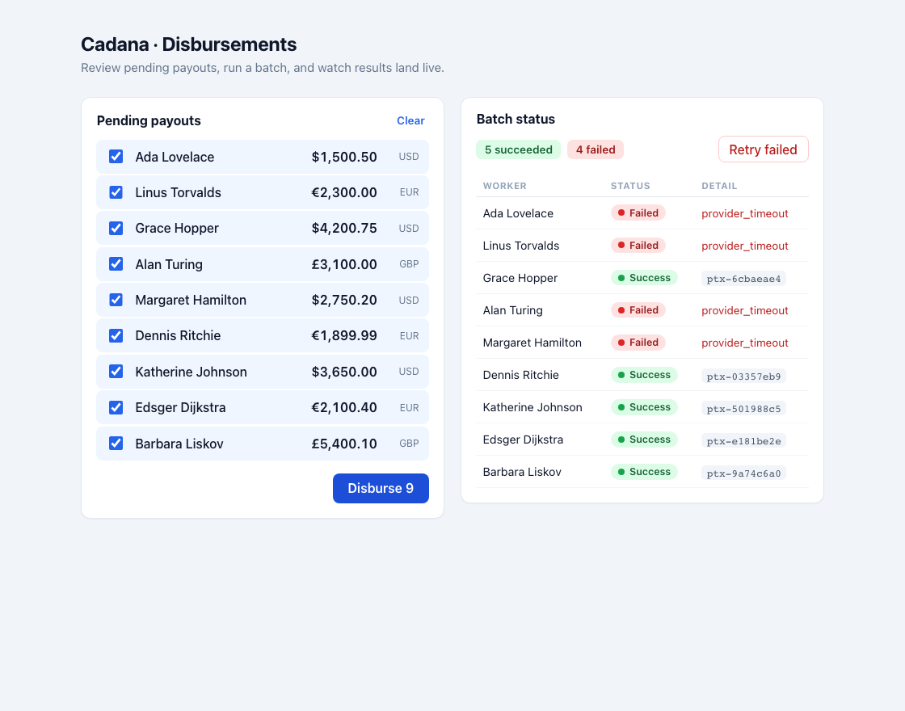

# Cadana · Disbursements

A small full-stack tool for payroll-ops: review pending payouts, kick off a disbursement
batch, and watch per-worker results stream in — even when the payment provider flakes.

[](https://github.com/zainishtiaqdev/cadana-disbursements/actions/workflows/ci.yml)

**Stack:** Go (backend) · Vue 3 + TypeScript (frontend) · optional Postgres/Supabase for durable state.



---

## Run it

**Backend** — in-memory, zero setup:
```bash
cd backend
make run      # serves on :8080
make test     # go test -race ./...
```

**Frontend:**
```bash
cd frontend
npm install
npm run dev   # http://localhost:5173 (proxies the API to :8080)
```

Open http://localhost:5173, select workers, hit **Disburse**, and watch the rows settle.

**Optional — durable Postgres:** the store is swappable. Set `DATABASE_URL` and the backend uses
Postgres instead of memory (the schema bootstraps on start):
```bash
cp backend/.env.example backend/.env   # set DATABASE_URL
cd backend && make run                 # logs "store: postgres"
```

---

## API

| Method | Path | Body | Returns |
|--------|------|------|---------|
| `GET`  | `/workers` | — | roster of workers with pending disbursements |
| `POST` | `/disbursements` | `{ batch_id, worker_ids }` | `202` + the batch (all `pending`) |
| `GET`  | `/disbursements/{batch_id}` | — | current per-worker status |

`batch_id` is **client-supplied** and acts as the idempotency key.

---

## Design notes

- **Idempotency** is keyed on the client-supplied `batch_id` (Stripe-style). Creating a batch is an
  atomic *create-if-absent*; resubmitting the same id returns the existing batch and never calls the
  provider again. In Postgres that's the `batches(id)` primary key with `INSERT … ON CONFLICT DO
  NOTHING`, so the guarantee holds across restarts and across processes.
- **Concurrency:** a batch is paid by one goroutine per worker, bounded by a semaphore and joined with
  a `WaitGroup`; the in-memory store is guarded by an `RWMutex`. A failure on one worker never blocks
  the others. The suite runs under `-race`.
- **Async + polling:** `POST` returns `202` immediately with every row `pending` and processes in the
  background; the UI polls `GET` until nothing is pending. That's what makes the provider's latency
  and ~30% failures *visible* instead of hidden inside one long request.
- **Money** is `shopspring/decimal` end to end and crosses the wire as a string — no `float64` ever
  touches an amount.
- **Storage behind an interface:** in-memory is the zero-setup default (one command, honors the
  brief); the Postgres adapter implements the same `Store` port and powers durable idempotency + the
  live demo. Tests run against the in-memory store, so CI needs no database.
- **Frontend state** lives in composables: `useDisbursementBatch` owns the batch lifecycle (submit,
  poll, cleanup), raw server data is held in `ref`s, and everything derived (the summary, the failed
  set) is `computed` so it can't drift. The API contract is hand-written and shared as one type module.

**Trade-off (given the ~1.5h box):** live status is **polled**, not pushed. Polling is simple and the
brief allows it; with more time I'd push updates over SSE/WebSocket to cut redundant requests and
tighten latency — not worth the extra moving parts at this scale.

---

## Tests

`backend/internal/disbursement/service_test.go` pins the two hard guarantees:

- **Idempotency** — six *concurrent* submits of the same `batch_id` pay each worker exactly once.
- **Partial failure** — a forced failure on one worker leaves the others successful and isolated.

```bash
cd backend && make test
```

CI runs the same suite under `-race` on every push — see the **Actions** tab.

---

## Layout

```
backend/    Go service — cmd/server + internal/{api,disbursement,store,provider}
frontend/   Vue 3 + TS SPA — api · composables · components
```
